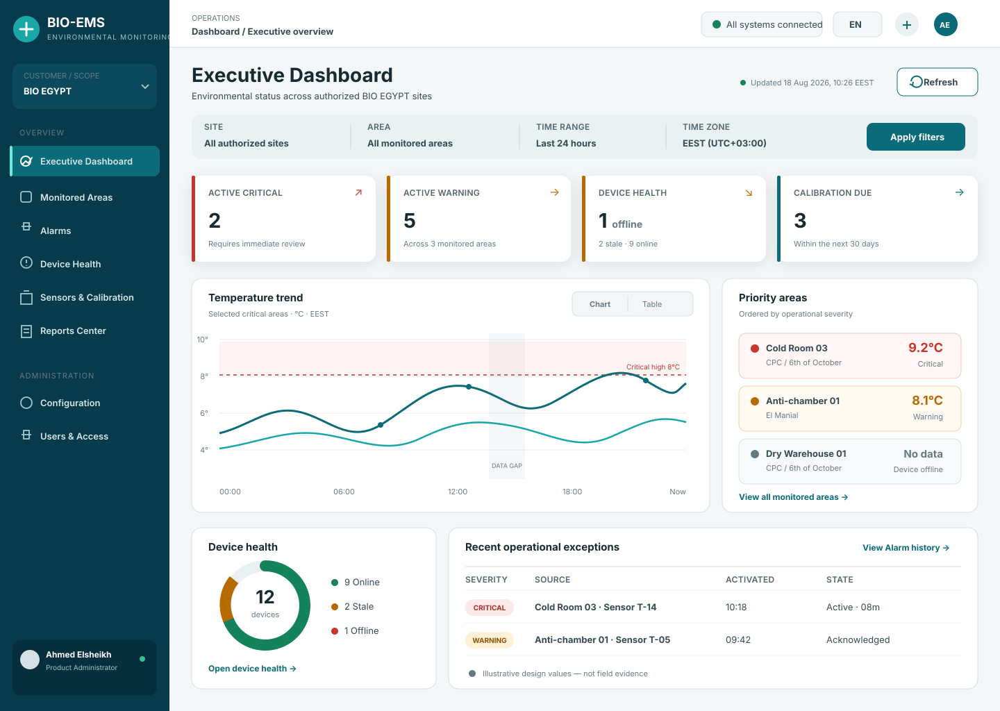

# Sprint 16 — S16-02 Design System and High-Value Wireframes

## Document control

| Field                 | Value                         |
| --------------------- | ----------------------------- |
| Work item             | S16-02                        |
| Status                | APPROVED — MERGED             |
| Requirements baseline | S16-01, merged through PR #41 |
| Visual direction      | Clinical Command Center       |
| Implementation state  | NOT STARTED                   |

## 1. Design intent

BIO-EMS should look like a trusted pharmaceutical operations product: calm under
normal conditions, unmistakable during an exception, dense enough for professionals,
and simple enough to understand within seconds.

The proposed direction is **Clinical Command Center**:

- deep teal navigation and identity, not generic corporate blue;
- cool neutral work surfaces with high-contrast white operational cards;
- restrained elevation, generous structure, and compact data presentation;
- severity colors reserved for real Domain state;
- charts that explain conditions and data gaps rather than decorate the page;
- clear customer, Site, scope, freshness, and authorization context.

This is an evolution of the current MUI application. It does not replace React,
AppShell, routing, authentication, authorization, localization, React Query, or the
existing Domain contracts.

## 2. Visual reference

The approved implementation should follow the hierarchy and information density in
the reference board below. Values are illustrative design content only and are not
BIO EGYPT field evidence.

## 3. Experience principles

1. **Status before decoration.** A user should identify critical conditions, stale
   information, and scope before reading details.
2. **Business context before hardware.** Site and Monitored Area lead; Device and
   channel details remain available through drill-down.
3. **One meaning per color.** Alarm, health, calibration, and neutral UI colors do not
   compete.
4. **Evidence is visible.** Freshness, time zone, filters, gaps, partial failures, and
   report identity are never hidden.
5. **Progressive density.** Summary first, operational evidence second, detailed table
   or record on demand.
6. **Bilingual by construction.** RTL/LTR behavior is a component contract, not a late
   translation pass.
7. **Accessible equivalence.** Critical chart meaning exists in text/table form.

## 4. Foundation tokens

### 4.1 Color system

| Token             | Proposed value | Use                                    |
| ----------------- | -------------- | -------------------------------------- |
| `brand.deep`      | `#073B4C`      | navigation rail, strong identity       |
| `brand.primary`   | `#0B6B78`      | primary actions, selected state, links |
| `brand.accent`    | `#18A6A6`      | focus accents and non-state highlights |
| `canvas.default`  | `#F3F7F8`      | application background                 |
| `surface.default` | `#FFFFFF`      | cards, tables, dialogs                 |
| `surface.subtle`  | `#EAF1F3`      | filter bar and grouped sections        |
| `text.primary`    | `#172B34`      | main content                           |
| `text.secondary`  | `#52666F`      | supporting content                     |
| `border.default`  | `#D5E0E3`      | card and table boundaries              |
| `state.normal`    | `#14825B`      | normal/online/valid only               |
| `state.warning`   | `#B76A00`      | warning/due/stale only                 |
| `state.critical`  | `#C7352C`      | critical/offline/expired only          |
| `state.unknown`   | `#667983`      | unknown/unavailable only               |
| `focus.ring`      | `#0E7490`      | three-pixel visible focus ring         |

State tokens must pass contrast review in their final background/text combinations.
The implementation may adjust values to meet WCAG contrast while preserving semantic
roles.

### 4.2 Typography

| Role          | Desktop specification               | Purpose                     |
| ------------- | ----------------------------------- | --------------------------- |
| Display       | 32/40, weight 700                   | Login/product identity only |
| Page title    | 28/36, weight 700                   | one `h1` per page           |
| Section title | 20/28, weight 700                   | major sections              |
| Card title    | 14/20, weight 600                   | metrics and panels          |
| Body          | 14/22, weight 400                   | general UI content          |
| Data          | 14/20, weight 600, tabular numerals | values and tables           |
| Caption       | 12/18, weight 500                   | freshness, units, metadata  |

Use a font stack that renders Arabic and Latin cleanly. Final font choice belongs to
implementation and must not introduce an external tracking or availability risk.

### 4.3 Spacing, radius, and elevation

- base spacing unit: 4 px, with common gaps of 8, 12, 16, 24, and 32 px;
- page maximum content width: 1600 px, fluid below it;
- compact card radius: 12 px; major surface/dialog radius: 16 px;
- controls: minimum 44 px target height for primary interactions;
- borders provide structure; shadow is reserved for overlays and high-level cards;
- no glassmorphism, low-contrast text, or decorative gradients behind operational
  data.

## 5. AppShell blueprint

### Desktop

- 248 px deep-teal navigation rail with product mark, environment/site context,
  grouped navigation, and collapsed option for later evaluation;
- 72 px top bar with breadcrumb, global Site selector, language/direction control,
  notification status, and User menu;
- content canvas uses a maximum width with responsive gutters;
- active navigation uses icon, text weight, and a high-contrast marker;
- navigation visibility continues to come from existing permissions.

### Tablet and narrow layouts

- navigation becomes a temporary drawer with focus restoration;
- top-level filters wrap into a dedicated filter surface;
- card grids reduce from four to two to one column;
- charts keep horizontal readability or offer a table view; critical actions remain
  visible without horizontal page scrolling.

## 6. Reusable component patterns

| Pattern         | Required anatomy and states                                                   |
| --------------- | ----------------------------------------------------------------------------- |
| Page header     | breadcrumb, `h1`, concise description, freshness/scope, primary action        |
| Metric card     | label, value, unit, semantic state, context/delta, drill-down target          |
| Status chip     | icon/shape, text, semantic color, accessible name                             |
| Filter bar      | scope, date/time, advanced filters, apply/reset, active-filter summary        |
| Chart panel     | title, scope, legend, time zone, plot, data-gap treatment, table toggle       |
| Data table      | caption, sortable headers, row status, pagination, empty/error/loading states |
| Evidence banner | partial/stale/offline message, affected scope, timestamp, recovery action     |
| Detail drawer   | identity, current state, related evidence, actions allowed by permission      |
| Form section    | heading, help, validation summary, field errors, save/cancel result           |
| Export dialog   | report identity, format, scope, language, progress, success/failure           |

## 7. High-value screen wireframes

### 7.1 Login

- split desktop composition: product trust/monitoring message on the brand surface and
  a focused authentication card;
- single-column card on tablet/mobile;
- username, password, submit, progress, and safe generic error only;
- language control remains available without distracting from authentication;
- no unapproved password reset, SSO, registration, or marketing behavior.

Requirement trace: `UX-002`, `UX-003`, `UX-004`, `UX-005`, `UX-006`, `UX-010`.

### 7.2 Executive Dashboard

- header: title, customer/Site scope, last refresh, refresh action;
- filter surface: Site, area, time range, and approved context filters;
- first row: Active Critical, Active Warning, Offline/Stale Devices, Calibration Due;
- main panel: temperature trend and thresholds, including gap/replay language only
  after S16-03 contracts;
- supporting panels: Site/area condition, Device-health distribution, recent Alarm
  activity, and prioritized exceptions;
- each metric and chart drills into an authoritative filtered view.

Requirement trace: `DASH-001` through `DASH-008`, `UX-009`, `UX-010`.

### 7.3 Monitored Areas

- Site grouping and compact area cards/list with current temperature, threshold state,
  open Alarms, communication state, and last update;
- switchable card/table presentation without changing the underlying meaning;
- search/filter, exception-first sorting, and direct area detail;
- humidity or other measurements are hidden when not part of the approved contract.

Requirement trace: `UX-001`, `UX-006`, `UX-007`, `UX-010`.

### 7.4 Alarms

- severity summary and active/history tabs;
- filter bar for Site, area, severity, state, time, and acknowledgment status;
- evidence-first table: Alarm identity, source, activation, duration, state,
  acknowledgment, recovery, and recurrence where supported;
- detail drawer with timeline and authorized acknowledgment action;
- critical state is never communicated by color alone.

Requirement trace: `UX-005`, `UX-007`, `UX-009`, `REP-002`.

### 7.5 Device Health

- Online/Stale/Offline summary with freshness context;
- Device list by Site and Controller showing heartbeat, last seen, firmware where
  available, reconnect/replay state, and affected areas;
- outage/availability chart appears only after reporting contracts are approved;
- infrastructure detail is secondary to operational impact.

Requirement trace: `DASH-003`, `DASH-008`, `REP-003`, `UX-010`.

### 7.6 Sensor and Calibration detail

- stable Sensor identity and location context;
- current value/status separated from calibration status;
- certificate reference, last calibration, due date, and append-only history;
- PASS/FAIL and expired/due states use Domain semantics;
- actions are permission-controlled and must never overwrite history.

Requirement trace: `DASH-006`, `REP-004`, `UX-007`.

### 7.7 Reports Center

- report-family gallery/list followed by a guided report builder;
- scope and range filter surface with an always-visible selection summary;
- preview contains report metadata, chart, underlying table, gaps/warnings, and page
  intent;
- PDF and CSV export actions open a controlled export dialog;
- generated/recent reports list is included only if S16-03 approves retention.

Requirement trace: `REP-001` through `REP-014`, `UX-003`, `UX-009`.

### 7.8 Configuration and Users

- configuration grouped by business concept, with infrastructure details clearly
  labeled;
- list/detail patterns, explicit create/edit modes, validation summary, and safe
  destructive confirmation;
- Users screen exposes only the existing approved administration capabilities;
- permission-denied and read-only modes remain deliberate screen states.

Requirement trace: `UX-001`, `UX-005`, `UX-006`, `UX-010`.

## 8. State matrix

Every implemented high-value screen must demonstrate applicable states:

| State                 | Presentation rule                                                        |
| --------------------- | ------------------------------------------------------------------------ |
| Loading               | stable skeleton or progress label without misleading zero values         |
| Empty                 | explain scope and next valid action; not an error                        |
| Error                 | identify failed section, preserve safe content, provide retry when valid |
| Partial               | keep successful panels and identify unavailable evidence explicitly      |
| Stale/offline         | show last-known time and avoid presenting it as current                  |
| Permission denied     | explain access boundary without exposing protected detail                |
| No results            | retain filters and provide reset/adjust guidance                         |
| Export pending/failed | announce progress/result and prevent duplicate accidental requests       |

## 9. RTL and localization contract

- MUI logical properties (`inlineStart`, `inlineEnd`) are preferred over physical
  left/right assumptions;
- navigation rail, breadcrumbs, drawers, table alignment, and directional icons mirror
  where meaning requires it;
- numeric telemetry, units, timestamps, serials, and report IDs remain readable in
  mixed-direction content;
- charts keep chronological meaning and localize labels without reversing data
  semantics accidentally;
- Arabic strings are reviewed at realistic expansion, not placeholder length;
- PDF pagination and table columns receive a separate RTL rendering review.

## 10. Accessibility and verification approach

- semantic landmark and heading review;
- full keyboard journey for Login, navigation, filters, table, dialogs, and export;
- visible focus and focus restoration tests;
- automated accessible-name and role assertions for reusable components;
- contrast verification for state combinations;
- chart summary/table equivalence tests;
- `prefers-reduced-motion` coverage;
- desktop, tablet, LTR, and RTL visual snapshots after implementation;
- loading, error, empty, partial, and permission fixtures for every major surface.

## 11. Contract and implementation boundaries

- the current Dashboard contract does not yet provide all proposed trend, calibration,
  Device-history, or data-quality values;
- unsupported visual modules remain design targets until S16-03 or a dedicated backend
  contract approves them;
- S16-02 does not add chart dependencies or select the final chart library;
- reports are not added to production navigation until route, permission, and backend
  contracts exist;
- current behavior remains unchanged until implementation PRs are reviewed and merged.

## 12. Product Owner review decisions

Approval is requested for:

1. the **Clinical Command Center** direction;
2. deep-teal navigation with light operational canvas;
3. compact professional density rather than oversized consumer-style cards;
4. exception-first Dashboard hierarchy;
5. Site/Monitored Area business context before Device details;
6. the eight high-value screen blueprints;
7. the token and accessibility rules as the S16-06/S16-07 implementation baseline.

Approval does not approve illustrative values in the SVG as production, customer, or
field data.

## 13. S16-02 acceptance criteria

S16-02 may close when:

- Product Owner approves the visual direction and high-value screen blueprints;
- all S16-01 UX and Dashboard requirements are traced;
- screen elements do not claim unavailable backend behavior;
- bilingual, responsive, accessibility, and state rules are explicit;
- implementation can extend the existing theme and AppShell without a parallel
  frontend architecture;
- formatting and repository CI pass;
- approval and merge evidence are recorded.
