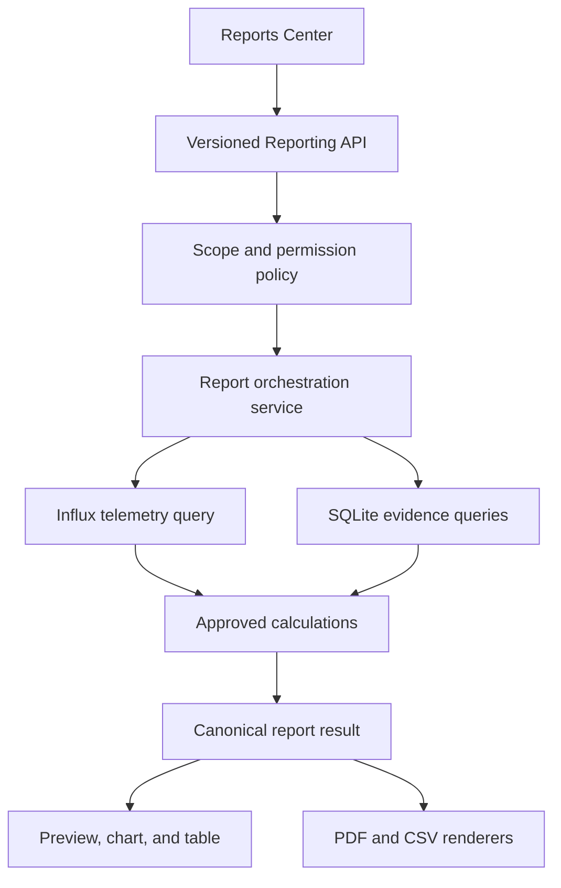

# Sprint 16 — S16-03 Reporting Catalogue and Architecture

## Document control

| Field                 | Value                                   |
| --------------------- | --------------------------------------- |
| Work item             | S16-03                                  |
| Status                | APPROVED — MERGED                       |
| Requirements baseline | S16-01, merged through PR #41           |
| UX consumer           | S16-02 Clinical Command Center baseline |
| Software baseline     | `main` after S16-02 closure             |
| Implementation state  | NOT STARTED                             |

## 1. Decision

BIO-EMS reporting will use a backend-owned reporting boundary that produces one
versioned report result for preview, chart, table, PDF, and CSV consumers.

- InfluxDB remains authoritative for telemetry samples.
- SQLite remains authoritative for configuration, Alarm, calibration, User, and
  available operational records.
- The backend correlates the sources by stable Site, Device, Sensor, and record
  identities.
- The frontend selects scope and renders an approved result; it does not perform hidden
  regulated calculations.
- Exports use the same result/calculation services as interactive preview.
- Missing history is declared as unavailable; it is never reconstructed from a current
  snapshot without an explicit rule.

This document approves architecture and calculation contracts for later
implementation. It does not add routes, persistence, permissions, queues, files, or
runtime behavior.

## 2. Current evidence inventory

| Source                     | Available evidence                                                                                                         | Current reporting limitation                                                                                                     |
| -------------------------- | -------------------------------------------------------------------------------------------------------------------------- | -------------------------------------------------------------------------------------------------------------------------------- |
| InfluxDB telemetry         | timestamp, Site code, Device ID, Sensor/channel identity, measurement, unit, value, LIVE/REPLAY write context where stored | current code exposes latest-only query; no approved range/aggregation query; retention is not documented here                    |
| SQLite Sites/Rooms/Sensors | identity, hierarchy, time zone field, thresholds, calibration snapshot                                                     | no versioned configuration or historical threshold timeline                                                                      |
| SQLite Alarms              | Sensor, type, severity, status, trigger value/time, acknowledgment time/User link, recovery time                           | read projection does not expose acknowledgment User; current lifecycle may not represent every post-acknowledgment recovery path |
| SQLite calibration records | append-only result, performer, date, due date, offset, certificate reference, notes                                        | report authorization and cross-Site list query are not implemented                                                               |
| SQLite Devices             | current status, latest communication/heartbeat timestamps                                                                  | snapshot only; no Device-health transition history or availability ledger                                                        |
| Notification events        | event and delivery-foundation evidence                                                                                     | not an approved general audit log or recipient-history report                                                                    |
| User/configuration actions | selected identities exist in specific records                                                                              | no general append-only audit-event store                                                                                         |

The inventory is a gate: a report family may be listed in the product catalogue while
its unavailable sections remain explicitly blocked from implementation.

## 3. Report catalogue

### 3.1 Temperature Performance Report — `TEMP-PERFORMANCE`

Purpose: demonstrate environmental readings, data quality, and recorded temperature
exceptions for a selected authorized scope and interval.

Minimum content:

- Site, Monitored Area, Sensor, hardware identity, unit, and report time zone;
- time-series chart and approved tabular series;
- minimum, maximum, time-weighted or sample average as explicitly selected;
- sample count, expected-sample basis when available, and gap count/duration;
- threshold overlay labeled with its evidence basis;
- recorded Alarm excursions, duration, severity, acknowledgment, and recovery evidence;
- LIVE/REPLAY treatment and partial-data warnings.

Initial readiness: **PARTIAL — architecture approved, range query and data-quality
contract required.**

### 3.2 Alarm History Report — `ALARM-HISTORY`

Purpose: provide traceable Alarm lifecycle evidence within an authorized scope.

Minimum content:

- Alarm ID, Site, area, Sensor, type, severity, trigger value and time;
- acknowledgment actor/time when recorded;
- recovery time and duration when recorded;
- state at report `asOf` time;
- recurrence grouping only under the approved deterministic rule;
- explicit incomplete-lifecycle indicator.

Initial readiness: **PARTIAL — current records exist; lifecycle/read-projection gaps
must be resolved before claiming complete evidence.**

### 3.3 Calibration Status and History Report — `CALIBRATION-HISTORY`

Purpose: demonstrate current calibration status and immutable calibration history.

Minimum content:

- Sensor identity, location, product grade, and hardware model;
- current state, last calibration, next due date, and certificate reference;
- append-only attempts with PASS/FAIL, performer, performed time, due time, offset,
  certificate reference, and controlled notes;
- due/overdue classification at report `asOf` time;
- missing certificate or identity warnings.

Initial readiness: **READY FOR CONTRACT DESIGN — authoritative append-only records
exist.**

### 3.4 Device Communication Health Report — `DEVICE-HEALTH`

Purpose: demonstrate communication availability, outages, reconnects, and replay
recovery.

Minimum content:

- Device/Site identity and affected Monitored Areas;
- Online/Stale/Offline transitions;
- transition time, duration, last heartbeat/telemetry, reconnect, and replay evidence;
- availability percentage only over a complete approved observation window.

Initial readiness: **BLOCKED — a current Device snapshot cannot prove historical
availability. A transition/observation ledger is required.**

### 3.5 Audit and Operations Report — `AUDIT-OPERATIONS`

Purpose: provide traceable configuration, security-relevant, acknowledgment, and
operational actions.

Minimum content:

- event ID/type, actor, authorized scope, target identity, timestamp, outcome, and safe
  before/after reference where approved;
- no password, token, secret, certificate private material, or unnecessary personal
  data.

Initial readiness: **BLOCKED — the project does not yet contain a general append-only
audit event store. Existing specialized records must not be presented as a complete
audit trail.**

## 4. Architecture boundary



### Required backend modules

| Module                  | Responsibility                                                     |
| ----------------------- | ------------------------------------------------------------------ |
| report catalogue        | supported families, versions, capabilities, limits                 |
| report request schema   | strict scope, time, time zone, aggregation, language, format       |
| report authorization    | report read/export plus underlying Site/domain permissions         |
| report orchestration    | resolve identities, capture `asOf`, query sources, assemble result |
| telemetry query adapter | parameterized range/aggregate queries with safe bounds             |
| evidence query adapters | Alarm, calibration, Device-health, and audit records               |
| calculation library     | deterministic statistics, gaps, duration, recurrence, coverage     |
| canonical result schema | one validated result for every renderer                            |
| PDF renderer            | branded paginated human-readable evidence                          |
| CSV renderer            | approved machine-readable datasets                                 |
| export lifecycle        | bounded generation, expiry, failure, and download authorization    |

Adapters depend on approved interfaces. Report calculations do not import frontend
code, and renderers do not re-query or recalculate business evidence.

## 5. Proposed API surface

All routes remain under `/api/v1` and require authentication.

| Method and route                      | Purpose                                             | Initial permission                               |
| ------------------------------------- | --------------------------------------------------- | ------------------------------------------------ |
| `GET /reports/catalogue`              | allowed families, capabilities, limits, and formats | `REPORT_READ`                                    |
| `POST /reports/preview`               | validated canonical result for chart/table preview  | `REPORT_READ` plus underlying scope permission   |
| `POST /reports/exports`               | create a bounded PDF or CSV export                  | `REPORT_EXPORT` plus underlying scope permission |
| `GET /reports/exports/:reportId`      | export status and safe metadata                     | same User or explicitly authorized shared scope  |
| `GET /reports/exports/:reportId/file` | authorized file stream                              | `REPORT_EXPORT`, ownership/scope rechecked       |

`REPORT_READ` and `REPORT_EXPORT` are proposed new permissions. Their role mapping must
be explicitly approved and tested; neither permission exists in the current code.

The request is a strict object containing:

- `reportType` and `contractVersion`;
- authorized `siteIds` and optional area/Device/Sensor identifiers;
- RFC 3339 `from` and `to` instants;
- IANA `timeZone`;
- approved `resolution` or `AUTO`;
- report language (`ar` or `en`);
- family-specific filters;
- export format only on the export route.

Unknown fields, inverted/empty ranges, unknown identities, unsupported combinations,
and unauthorized mixed-Site scope are rejected before source queries.

## 6. Canonical report result

Every result contains:

```text
identity
  reportId, reportType, contractVersion, status, generatedAt, asOf
scope
  customer, Sites, Monitored Areas, Devices, Sensors
request
  from, to, timeZone, resolution, filters, language
provenance
  softwareVersion, sourceWatermarks, calculationVersion, thresholdBasis
quality
  complete, warnings, gaps, delayedCount, replayCount, unavailableSections
summary
  family-specific approved metrics
series
  typed chart/table series with unit and quality flags
records
  family-specific evidence rows
```

`complete: true` means the approved completeness rules passed. It does not mean the
environment was compliant or free of Alarms.

All numbers remain numeric in JSON. Localization, formatted dates, and display labels
are presentation fields or renderer concerns; they never replace raw contract values.

## 7. Time and range rules

- API timestamps are RFC 3339 instants and are normalized internally to UTC.
- Report display uses an explicit IANA time zone. Site time zone is the default only
  when one Site is selected and its value is valid.
- A multi-Site report must select one explicit display time zone and still preserve
  each Site identity.
- The interval is half-open: `[from, to)`. A sample exactly at `to` belongs to the next
  interval.
- `asOf` is captured once by the backend at orchestration start and used for all
  current/open duration calculations.
- Daylight-saving transitions display offset information and do not duplicate or omit
  UTC evidence.
- Calendar-day groupings follow the selected IANA time zone; fixed-duration buckets
  remain UTC-duration based and are labeled accordingly.

### Initial range profiles

| Profile                   | Maximum requested range | Resolution/result limit                                  |
| ------------------------- | ----------------------: | -------------------------------------------------------- |
| Interactive preview       |                 31 days | maximum 5,000 plotted rows/points across returned series |
| Raw CSV                   |                  7 days | maximum 250,000 rows; no silent truncation               |
| Aggregated PDF/CSV        |                366 days | maximum 25,000 tabular rows after approved aggregation   |
| Alarm/calibration records |      366 days initially | paginated/streamed with explicit record count limit      |

The implementation may lower limits from measured performance evidence. Raising them
requires load evidence. If a request exceeds a limit, the API returns a safe structured
error with a smaller-range or coarser-resolution recommendation.

## 8. Resolution and aggregation rules

`AUTO` selects a resolution that keeps every returned series within the preview limit.
The selected resolution is returned and printed in exports.

For each telemetry bucket, the approved basic statistics are:

- `count`: accepted stored samples included in the calculation;
- `minimum` and its earliest timestamp in case of a tie;
- `maximum` and its earliest timestamp in case of a tie;
- `sampleAverage = sum(values) / count`;
- first and last accepted sample times;
- LIVE and REPLAY counts;
- gap/quality flags.

The initial average is explicitly a **sample average**, not a time-weighted average.
A time-weighted average requires a separate approved algorithm and sampling/gap rules.

Rounding is presentation-only. Calculations retain stored numeric precision; display
precision and CSV numeric formatting are specified with the measurement contract.

## 9. Missing, delayed, duplicate, and replayed data

### Expected interval

Coverage and gap calculations require an approved expected reporting interval for the
Sensor/Device. If no authoritative interval exists:

- the report may show observed sample count and timestamp discontinuities;
- it may not claim an availability percentage;
- the quality section states that expected coverage is unavailable.

### Gap rule

When the expected interval exists, a gap starts when consecutive accepted sample times
are more than `2 × expectedInterval` apart. Gap duration is the observed separation
minus one expected interval. Boundary gaps are calculated only when source watermark
and observation rules make them provable.

### Delayed and REPLAY samples

- event time determines the sample's chronological position;
- ingest/receipt time, when retained, determines delay evidence;
- REPLAY is included in environmental statistics once, at original event time;
- quality metadata reports replay counts and affected intervals;
- REPLAY never retroactively re-evaluates an Alarm unless a separately approved rule
  changes the existing Domain behavior.

### Duplicate rule

The canonical deduplication key must be approved from persisted fields. Until that key
is proven, the report does not silently discard equal values or equal timestamps.
Potential duplicates are a quality warning, not an automatic calculation change.

## 10. Thresholds, excursions, and Alarm evidence

BIO-EMS does not currently retain a versioned threshold history. Therefore:

- recorded Alarm rows are authoritative for Alarms that the system actually created;
- a current Sensor threshold may be shown only as **threshold at generation**;
- a current threshold must not be labeled as the historical threshold for older
  telemetry;
- telemetry-derived excursion reconstruction is blocked until threshold-effective
  dating is available or an approved report explicitly accepts current-threshold
  analysis as a non-historical simulation.

Alarm duration uses persisted lifecycle times:

- recovered: `recoveredTime - triggerTime`;
- open at `asOf`: `asOf - triggerTime`, labeled open;
- missing or inconsistent terminal time: duration unavailable with a quality warning.

Acknowledgment does not end an environmental excursion. Current Alarm lifecycle and
read projections must be reviewed so that acknowledged-then-recovered evidence is not
lost or misrepresented.

Recurrence groups only records with the same Sensor, Alarm type, and severity when the
next trigger occurs within a configured displayed recurrence window after recovery.
The window value is a report parameter/versioned rule and is always printed.

## 11. Device-health availability

Availability is blocked until a persistent transition or observation model exists.
The required evidence must include:

- Device identity and Site;
- previous/new state (`ONLINE`, `STALE`, `OFFLINE`);
- effective time and server observation time;
- transition reason/source;
- last telemetry and heartbeat context;
- reconnect and replay-recovery evidence;
- stable deduplication/correlation identity.

Availability percentage is:

`proved ONLINE duration / proved observable duration × 100`.

Unknown, pre-enrollment, maintenance-excluded, or unobserved intervals are reported
separately and never counted as Online.

## 12. Audit boundary

A general Audit Report remains blocked until an append-only audit-event contract is
approved. It must define actor, action, target, scope, timestamp, outcome, correlation,
safe before/after evidence, retention, and tamper/privilege controls.

Alarm acknowledgment and calibration performer identities remain valid specialized
evidence. They may appear in their own report families but cannot be advertised as a
complete system audit trail.

## 13. PDF contract

The PDF renderer must include:

- BIO-EMS identity and approved customer/Site heading;
- report title, ID, contract/calculation version, generation time, and generating User;
- selected period, time zone, resolution, scope, and filter summary;
- completeness state, warnings, unavailable sections, and source watermark summary;
- charts with legends, units, thresholds basis, and gap/replay indication;
- underlying summary/evidence tables;
- page number and stable repeated header/footer;
- approval/signature placeholders only where the template requires them;
- Arabic or English layout generated from the same canonical result.

A generated placeholder is not an electronic signature. PDF generation does not imply
approval or customer acceptance.

## 14. CSV contract

- UTF-8 with BOM only if compatibility testing demonstrates it is required;
- comma delimiter, RFC 4180 quoting, CRLF line endings for broad Windows compatibility;
- ISO 8601 timestamps including offset or `Z`;
- stable English machine column identifiers in version 1;
- unit, time zone, report ID, and contract version represented in metadata/header rows
  or documented companion columns;
- one approved dataset per file; multi-table reports use a deterministic ZIP/manifest
  only after that package contract is approved;
- no localized numeric separators in machine values;
- formula-injection protection for text cells beginning with spreadsheet control
  characters.

CSV export is evidence data, not a visual replica of the PDF.

## 15. Export lifecycle, identity, and retention

Proposed report ID format:

`RPT-<UTC YYYYMMDD>-<ULID>`

Proposed safe filename:

`bio-ems_<report-type>_<site-scope>_<from-date>_<to-date>_<report-id>.<ext>`

Only normalized ASCII slugs enter filenames; customer display names remain inside the
report.

Exports are generated asynchronously when they cannot complete within the normal API
response budget. Status values are `QUEUED`, `RUNNING`, `READY`, `FAILED`, and
`EXPIRED`. Failure details are safe and do not expose queries, credentials, or paths.

Initial generated-file retention is **24 hours** with metadata retained for operational
diagnosis according to the future approved retention policy. This is not regulated
record retention; customers must store approved reports in their controlled record
system. Longer retention requires a security, storage, deletion, and customer-contract
decision.

## 16. Authorization and security

- authenticate every route;
- authorize report family, action, and every selected Site/domain identity;
- reject mixed authorized/unauthorized scope as a whole;
- bind export metadata and download to requester plus authorized scope;
- use unguessable report IDs without relying on secrecy of the ID;
- recheck authorization at download time;
- prevent path traversal, unsafe filename content, CSV injection, and unbounded query
  construction;
- rate-limit preview and export creation separately;
- never log report bodies, recipient lists, credentials, tokens, or sensitive notes;
- exclude calibration notes from broad reports unless their approved purpose and role
  require them;
- record generation outcome in the future audit boundary without storing secrets.

## 17. Error contract

Reporting uses the existing safe API error envelope with stable reporting codes:

- `REPORT_TYPE_UNSUPPORTED`;
- `REPORT_RANGE_INVALID`;
- `REPORT_RANGE_TOO_LARGE`;
- `REPORT_SCOPE_INVALID`;
- `REPORT_SOURCE_UNAVAILABLE`;
- `REPORT_DATA_INCOMPLETE` when policy forbids generation;
- `REPORT_EXPORT_FAILED`;
- `REPORT_NOT_FOUND` for missing or unauthorized IDs without disclosing existence;
- `REPORT_EXPIRED`.

Partial results are returned only when the family policy permits them and must carry
`complete: false` plus warnings. Source failures never become empty success results.

## 18. Implementation sequence

1. canonical request/result schemas, catalogue, permissions, and contract tests;
2. Temperature range query and deterministic calculation/gap fixtures;
3. Alarm read/lifecycle evidence corrections and report adapter;
4. Calibration report adapter;
5. preview API and Reports Center integration;
6. CSV renderer and injection/encoding tests;
7. PDF renderer and bilingual golden/visual tests;
8. bounded asynchronous export lifecycle when performance requires it;
9. Device-health history model and report only after its dedicated design approval;
10. general audit store and report only after its dedicated design approval.

Each implementation PR remains independently reviewable. Database migrations are
append-only and cannot rewrite historical migrations.

## 19. Verification strategy

- fixed-clock calculation tests with known boundaries;
- UTC, IANA time zone, DST, `[from,to)`, and bucket-boundary fixtures;
- raw versus aggregated minimum/maximum/average fixtures;
- missing, delayed, REPLAY, duplicate-candidate, and source-failure fixtures;
- Alarm open/recovered/incomplete lifecycle cases;
- calibration PASS/FAIL/current-state cases;
- authorization tests for each route, scope, User, and export download;
- range, point/row, timeout, memory, and concurrency limits;
- PDF metadata, page, RTL/LTR, chart/table, and warning rendering tests;
- CSV encoding, quoting, timestamps, units, formula-injection, and row consistency;
- result equality tests proving preview and export share calculations;
- no secret or personal-data leakage in logs and safe errors.

## 20. S16-03 acceptance criteria

### Requirements trace

| S16-01 requirement | S16-03 decision                                                        |
| ------------------ | ---------------------------------------------------------------------- |
| `REP-001`          | Temperature Performance catalogue and calculation/data-quality rules   |
| `REP-002`          | Alarm History catalogue, duration, lifecycle, and recurrence rules     |
| `REP-003`          | Device Health catalogue classified BLOCKED pending history evidence    |
| `REP-004`          | Calibration Status and History catalogue and authoritative records     |
| `REP-005`          | Audit catalogue classified BLOCKED pending general audit store         |
| `REP-006`          | InfluxDB/SQLite source boundary and adapters                           |
| `REP-007`          | UTC, IANA time zone, DST, precision, and `[from,to)` rules             |
| `REP-008`          | raw/aggregate profiles, bucket statistics, precision, and limits       |
| `REP-009`          | missing, delayed, duplicate-candidate, LIVE, and REPLAY rules          |
| `REP-010`          | range, point/row, timeout, asynchronous export, and failure rules      |
| `REP-011`          | branded bilingual PDF contract and verification                        |
| `REP-012`          | deterministic CSV encoding, columns, timestamps, and security contract |
| `REP-013`          | report and export permission/scope boundary                            |
| `REP-014`          | report ID, filename, lifecycle, and retention decisions                |

### Closure gates

S16-03 may close when:

- Product Owner approves the five-family catalogue and phased readiness decisions;
- architecture review approves the backend-owned canonical result boundary;
- time, range, aggregation, gap, REPLAY, threshold, duration, PDF, and CSV rules are
  explicit;
- current source capabilities and gaps are accurately classified;
- Device-health history and general Audit remain blocked until persistent evidence
  exists;
- proposed permissions, limits, retention, and implementation sequence are accepted;
- no runtime behavior or unsupported evidence claim is introduced;
- formatting and repository CI pass;
- approval and merge evidence are recorded.

## 21. Product Owner decisions requested

Approval is requested for:

1. the five report families and their readiness classification;
2. backend-owned calculations and one canonical result for preview/PDF/CSV;
3. initial range and row/point limits;
4. sample average as the initial declared average;
5. `[from,to)` time semantics and explicit IANA report time zone;
6. recorded Alarms as the initial historical excursion evidence;
7. Device-health history and complete Audit remaining blocked until persistence exists;
8. proposed `REPORT_READ` and `REPORT_EXPORT` permissions;
9. 24-hour generated-file retention as delivery cache, not regulated retention;
10. the phased implementation and verification sequence.
