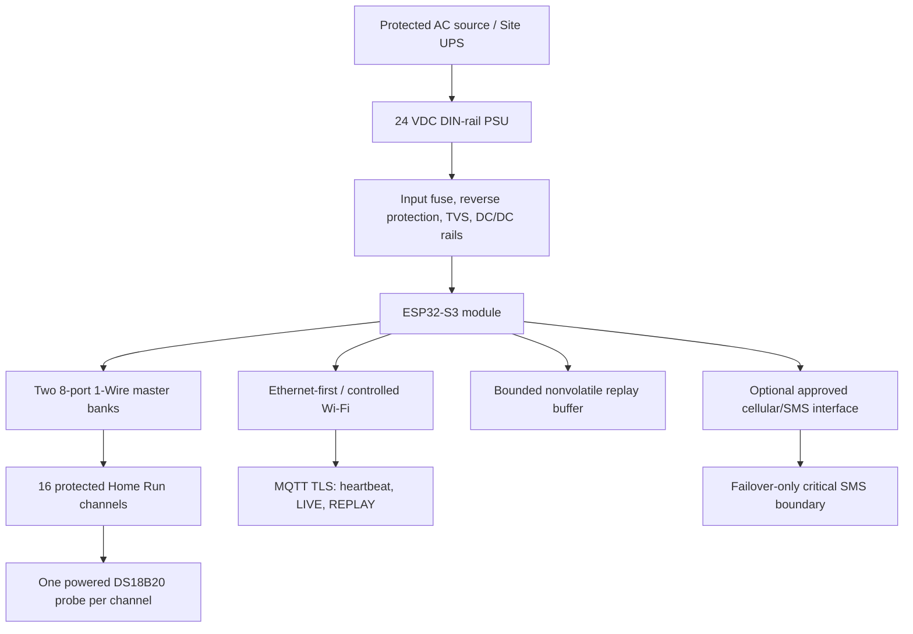

# Sprint 16 — S16-04 Site Controller v1 Hardware Design Review

## Document control

| Field                 | Value                                                      |
| --------------------- | ---------------------------------------------------------- |
| Work item             | S16-04                                                     |
| Status                | PROPOSED — ENGINEERING AND PRODUCT OWNER REVIEW REQUIRED   |
| Requirements baseline | S16-01, merged through PR #41                              |
| Pilot scope           | Two Sites, eight Monitored Areas, 20 temperature Sensors   |
| Design maturity       | CONCEPT REVIEW — NOT RELEASED                              |
| Procurement authority | PROTOTYPE ONLY AFTER REVIEW; PILOT QUANTITY NOT AUTHORIZED |
| Field status          | NOT SURVEYED / NOT COMMISSIONED / NOT ACCEPTED             |

## 1. Review decision

BIO-EMS retains the approved Site/Zone Controller architecture and advances a
**proposed 16-channel Site Controller v1** to detailed design and prototype.

The proposed controller uses:

- an ESP32-S3 module as the first firmware platform;
- dedicated 1-Wire master ports rather than direct long-line GPIO buses;
- one externally powered, three-wire industrial DS18B20 probe assembly per Home Run
  channel;
- protected pluggable field terminals;
- 24 VDC nominal panel input converted to internal rails;
- Ethernet-first deployment capability with controlled Wi-Fi support;
- provision for an approved local cellular/SMS failover interface without selecting a
  modem, provider, SIM, or recipient in this review;
- bounded nonvolatile ring buffering with chronological `REPLAY` after reconnection;
- hardware/software watchdog and deterministic recovery behavior.

This is a **proposed engineering baseline**, not a released circuit. Channel electrical
design, cable limits, protection values, isolation, power rating, environmental rating,
component substitutions, and field suitability require S16-08 design/prototype/FAT
evidence and applicable S16-05 survey evidence.

## 2. Evidence reviewed

### Repository evidence

- ADR-012 accepts the Controller hardware boundary and generic Device identity.
- ADR-013 makes the ante-chamber the default placement where available.
- ADR-014 accepts one Home Run per Sensor/dedicated channel.
- S15-05 defines local critical SMS eligibility during primary Internet loss.
- the Site Controller integration contract defines MQTT TLS, Site/Device identity,
  heartbeat, LIVE, REPLAY, ordering, acknowledgment, and overflow obligations.
- BIO EGYPT Pilot scope fixes two Sites, eight Monitored Areas, 20 temperature Sensors.
- all five previous files under `docs/hardware/` were empty at review start; therefore
  no prior schematic, BOM, cable specification, enclosure rating, or released revision
  existed.

### Primary component guidance

- Analog Devices DS18B20 documentation defines the 1-Wire Sensor device, its unique ROM
  identity, powered/parasite modes, measurement behavior, and component-level limits.
- Analog Devices long-line guidance warns that reliable 1-Wire operation depends on
  topology, cable capacitance, reflections, driver behavior, and validation.
- Analog Devices documentation identifies DS2482-family I2C-to-1-Wire masters,
  including an eight-port device, as a supported master approach.
- Espressif ESP32-S3 datasheet and hardware-design guidance govern module power,
  decoupling, reset, RF placement, PCB layout, and reference design.

Primary references appear in Section 18. Supplier availability and lifecycle remain a
BOM review gate; a functional datasheet is not procurement approval.

## 3. Terminology decision

The product-facing term is **BIO-EMS Site Controller v1**. Existing ADRs may call the
same architectural hardware boundary a **Zone Controller**.

- Controller: physical panel/electronics assembly.
- Device: one firmware/backend identity hosted by that Controller.
- Channel: one implemented physical Sensor interface mapped to one Sensor record.
- Sensor: measurement source/probe with its controlled identity and calibration
  evidence.

No new Zone Controller backend entity is introduced by this review. The existing
generic Device and Sensor/channel contracts remain authoritative.

## 4. Proposed system block diagram

The diagram expresses functional boundaries only. It does not specify final parts,
ratings, isolation domains, connector pins, or protective-component values.

## 5. Requirement disposition

| ID       | Disposition      | Review conclusion                                                                                                                                                                                                     | Release evidence required                                                                                    |
| -------- | ---------------- | --------------------------------------------------------------------------------------------------------------------------------------------------------------------------------------------------------------------- | ------------------------------------------------------------------------------------------------------------ |
| `HW-001` | PROPOSED         | 16-channel Controller nominally covers 7-Sensor and 13-Sensor Pilot Sites with reserve; one Controller per Site remains a planning assumption.                                                                        | channel implementation, power/cable validation, and Site survey                                              |
| `HW-002` | PROPOSED         | ESP32-S3 module, hardware/software watchdog, controlled boot/recovery, signed firmware boundary, and immutable identity are the detailed-design direction. OTA remains disabled for Pilot unless separately approved. | schematic, secure-boot/flash decision, recovery tests, firmware release                                      |
| `HW-003` | PROPOSED         | externally powered three-wire industrial DS18B20 probe assembly; parasite power is excluded from the standard long Home Run design.                                                                                   | genuine-device/supplier evidence, assembly drawing, materials/rating, calibration and thermal-response tests |
| `HW-004` | BLOCKED          | Home Run and one Sensor per channel are confirmed; cable construction, conductor allocation, shield rule, termination, and maximum length are unconfirmed.                                                            | cable calculations, worst-case prototype test, EMI/environment review, field routes                          |
| `HW-005` | BLOCKED          | each channel requires replaceable terminal protection and open/short/disconnect diagnosis; exact ESD/surge/reverse/short/isolation design is not selected.                                                            | schematic, component ratings, fault injection, immunity/safety review                                        |
| `HW-006` | PROPOSED/BLOCKED | 24 VDC nominal panel distribution with protected conversion is proposed; PSU wattage, branch fusing, earthing, UPS autonomy, and brownout thresholds are blocked.                                                     | power budget, Site supply/earthing/UPS survey, thermal and recovery tests                                    |
| `HW-007` | PROPOSED/BLOCKED | Ethernet-first plus controlled Wi-Fi is proposed; local cellular/SMS provision is required by failover direction, while modem/provider/SIM/antenna and exact network hardware are blocked.                            | interface selection, RF/network survey, security review, failover test                                       |
| `HW-008` | PROPOSED         | bounded flash ring buffer, original event time, LIVE/REPLAY flag, chronological replay, stable record identity, acknowledgment-before-delete, and overflow evidence.                                                  | capacity/wear calculation, corruption/power-loss tests, outage/replay FAT                                    |
| `HW-009` | BLOCKED          | serviceable DIN-rail panel/enclosure is proposed; IP rating, condensation control, thermal design, glands, spacing, and material await Site conditions.                                                               | mechanical drawing, survey, environmental/thermal evidence                                                   |
| `HW-010` | BLOCKED          | no approved BOM, price, supplier, lifecycle, or substitution matrix exists.                                                                                                                                           | controlled BOM, quotations, lifecycle check, approved alternatives                                           |
| `HW-011` | PROPOSED         | `SC1` hardware family, board/panel revision, firmware version, Controller serial, Device ID, channel, probe serial/ROM, and FAT record will be traceable.                                                             | released naming/label schema and production record templates                                                 |
| `HW-012` | CONFIRMED        | no full Pilot quantity may be procured from an unreleased revision.                                                                                                                                                   | signed S16-08 design-freeze and prototype/FAT approval                                                       |

`CONFIRMED` means a governance/architecture rule is supported by existing approved
evidence. It does not turn a proposed electrical circuit into released hardware.

## 6. Channel architecture

### Proposed topology

- 16 physical Home Run ports grouped as two banks of eight 1-Wire master ports;
- one DS18B20 assembly per port despite 1-Wire's multi-drop capability;
- external Sensor power, data, and ground conductors; no parasite-powered standard
  installation;
- stable mapping between physical terminal, firmware channel, DS18B20 ROM identity,
  platform Sensor, cable label, calibration certificate, and Map ID;
- a fault on one Home Run must not prevent acquisition from unrelated channels;
- firmware periodically verifies the expected ROM identity instead of silently
  accepting a replaced/unmapped probe.

### Why dedicated masters are proposed

Direct ESP32 GPIO may work on a short bench cable but does not by itself establish a
reliable, protected, long-line product. Dedicated masters provide a controlled timing
and drive boundary and allow channel-level fault isolation. The final master part is
not released until availability, electrical compatibility, firmware support, and
prototype results are reviewed.

### Unresolved electrical decisions

- master IC and I2C address/control strategy;
- pull-up/active pull-up values per cable condition;
- Sensor supply rail and voltage-drop budget;
- connector pinout and grounding arrangement;
- shield/earth termination;
- common-mode and galvanic-isolation need;
- transient/ESD device type and capacitance;
- field-replaceable fuse/PTC strategy;
- diagnostic thresholds for open, short, wrong ROM, CRC failure, and intermittent
  communication.

## 7. Sensor assembly decision

The DS18B20 silicon selection does not approve a generic marketplace waterproof probe.
The released assembly must define:

- manufacturer and traceable genuine DS18B20 source;
- probe tube material/dimensions and potting compound;
- cable material, temperature rating, flexibility, cleanability, and length options;
- strain relief, ingress target, termination, and serial/ROM labeling;
- component accuracy limits separately from assembled-system calibration;
- response-time and self-heating evidence in the intended installation method;
- calibration procedure, uncertainty, certificate, acceptance tolerance, and due date;
- approved supplier and incoming inspection against counterfeit or wrong-ROM parts.

No claim of pharmaceutical suitability, IP rating, or assembled accuracy may be copied
from the bare IC datasheet.

## 8. Power architecture

### Proposed boundary

- Site protected AC feeds a listed/approved DIN-rail 24 VDC power supply;
- Controller low-voltage input receives branch protection, reverse-polarity protection,
  transient suppression, filtering, and monitored conversion to internal rails;
- Sensor power is budgeted separately from MCU, network, storage, and cellular peak
  loads;
- controlled brownout detection prevents corrupted buffer/index state;
- restart restores identity, time, channel map, buffer, heartbeat, current LIVE sample,
  then chronological REPLAY.

### Required power budget

S16-08 must calculate worst case for:

- all 16 Sensors converting/communicating;
- both master banks and channel protection leakage;
- ESP32-S3 boot, Wi-Fi transmit, and Ethernet interface;
- nonvolatile write peak;
- cellular registration/transmit peak when the approved modem exists;
- indicators, service interface, relays if later approved, and conversion losses;
- temperature derating and at least the approved engineering margin.

The PSU, DC/DC, fuse, conductor, connector, and UPS ratings remain unapproved until this
budget and Site evidence exist.

## 9. Communication and security boundary

### Confirmed software-facing behavior

- exact provisioned Site and Device identity;
- production MQTT over authenticated TLS;
- topic ACL limited to the Site/Device pair;
- QoS 1, retained false for telemetry/heartbeat;
- backend receipt time for communication-health status;
- strict heartbeat and telemetry payloads;
- LIVE after reconnect, then chronological REPLAY;
- no Alarm re-evaluation or emergency SMS from REPLAY;
- registration, remote command, provisioning, OTA, and response topics remain disabled
  for the Pilot unless separately implemented and approved.

### Proposed hardware/firmware security

- unique per-Device credentials, not a fleet-wide secret;
- protected credential storage and production provisioning procedure;
- secure boot and flash-encryption decision based on ESP32-S3 support and recovery plan;
- disable or protect debug/service interfaces on released units;
- signed firmware release with version and hash in the FAT record;
- fail closed on identity/configuration corruption;
- no credentials, phone numbers, AP passwords, certificates, or broker details in the
  repository or printed general documentation.

Exact credential element, secure storage, Ethernet interface, and provisioning tooling
are S16-08 decisions.

## 10. Offline buffer target

The proposed minimum design target is **seven days of all-channel readings at the
approved Pilot sampling interval**, plus operational events required for replay and
diagnosis.

The target is not a confirmed capacity until S16-08 records:

- interval and maximum channels;
- encoded record size and metadata;
- filesystem/ring overhead;
- flash endurance, wear leveling, and expected write life;
- corruption/power-cut recovery;
- overflow policy and visible evidence;
- maximum replay duration/rate without starving LIVE acquisition;
- QoS acknowledgment and safe deletion rule.

Overflow must preserve an explicit lost-range/count record. It must not silently appear
as continuous telemetry.

## 11. Local Alarm and SMS boundary

During verified primary Internet loss, the Controller must evaluate configured
critical temperature thresholds locally and may send a failover SMS only under the
approved S15-05 decision table.

Blocked before release:

- reliable Internet-availability detection;
- synchronized threshold/configuration provisioning;
- stable local Alarm episode/deduplication identity;
- recipient/escalation configuration and secure storage;
- modem/interface/provider/SIM/antenna selection;
- E.164 test recipients and customer approval;
- delivery receipts, retry/rate limits, credit and regulatory ownership;
- reconciliation with backend notification evidence after reconnection.

No development SIM or personal number may become production evidence.

## 12. Mechanical and installation requirements

The proposed controller is a serviceable labeled panel assembly outside cold space,
preferably in the ante-chamber when survey evidence supports ADR-013.

Detailed design must define:

- enclosure material, size, mounting, door/cover, lock/tamper approach, and IP target;
- DIN rail, PCB mounting, terminal segregation, bend radius, and service clearance;
- mains versus SELV separation and approved electrical responsibilities;
- cable glands, blanking plugs, drip loops, shield/earth bar, labels, and spare entries;
- heat sources, ventilation without compromising rating, condensation strategy, and
  operating limits;
- external antenna placement where applicable;
- replaceable terminals/modules and safe isolation for service;
- Controller serial/revision, supply, network, channel, warning, and terminal labels.

The enclosure is not placed inside a controlled cold room unless a separately released
environmental design explicitly permits it.

## 13. BIO EGYPT capacity assessment

| Site                 | Sensors | Nominal 16-channel reserve | Review status                                                  |
| -------------------- | ------: | -------------------------: | -------------------------------------------------------------- |
| El Manial            |       7 |                          9 | logical capacity only; cable/power/network/location unverified |
| CPC / 6th of October |      13 |                          3 | logical capacity only; cable/power/network/location unverified |

One Controller per Site is therefore a reasonable planning baseline, but it is not a
mounting or electrical approval. A survey finding that violates tested cable limits,
serviceability, power, network, environmental, or route constraints triggers a
controlled split-controller/scope decision.

## 14. Field measurements required before design freeze

For each Site, S16-05 must provide:

- approved Controller position and ambient temperature/humidity/condensation risk;
- service clearance, security/access, mounting surface, and cable-entry constraints;
- route and measured length for every Sensor Home Run;
- cable containment, shared routes, interference sources, penetrations, and sealing;
- mains voltage/source, protective device, earthing, outage behavior, and available
  UPS/autonomy;
- Ethernet outlet/path or Wi-Fi RSSI/roaming evidence at the Controller position;
- DNS, NTP, firewall, Internet restrictions, and approved MQTT egress;
- cellular signal evidence and antenna restrictions if local SMS remains required;
- drilling, hygiene, fire stopping, shutdown, permit, and work-hour restrictions;
- approved threshold, delay, sampling interval, notification, and escalation inputs;
- final Site/area/Controller/Device/channel/Sensor/serial/calibration identity inputs.

No planned distance may be copied as an installed measurement.

## 15. Prototype test plan

### Electrical and channel tests

- all 16 channels populated and operated concurrently;
- each channel at zero, nominal, and worst validated cable length;
- open, data-to-ground short, supply short, wrong ROM, CRC error, intermittent contact,
  reversed/miswired field connection, and adjacent-channel fault;
- voltage-drop, waveform/timing, pull-up behavior, communication error rate, protection
  temperature, and recovery;
- ESD/transient/immunity tests selected by engineering review for the environment;
- no unrelated-channel data loss from one channel fault.

### Power and recovery tests

- minimum/nominal/maximum approved input and load;
- cold start, repeated power cycling, brownout, abrupt power cut during buffer write,
  watchdog reset, firmware crash, and network-interface reset;
- measured peak/steady power, rail margin, enclosure temperature rise, and PSU derating;
- UPS transition/autonomy after Site input is known.

### Firmware/integration tests

- exact Site/Device/channel/probe identity and rejection of mismatches;
- trusted MQTT TLS and ACL;
- heartbeat Online/Stale/Offline/recovery boundaries;
- LIVE telemetry and local critical evaluation;
- seven-day target buffer calculation plus accelerated fill/overflow;
- restart persistence, current LIVE first, chronological REPLAY, QoS acknowledgment,
  duplicate tolerance, and no Alarm/SMS from REPLAY;
- offline critical SMS eligibility/deduplication only after the cellular boundary is
  approved;
- firmware version/hash, configuration revision, logs, defects, rework, retest, and
  approver captured.

### Environmental and manufacturing tests

- enclosure thermal behavior at approved ambient limits;
- condensation/ingress strategy tests appropriate to the released rating;
- terminal pull/strain relief, labels, polarity/keying, maintainability, and replacement;
- minimum continuous burn-in duration selected before FAT;
- reproducible assembly, inspection, programming, and production-test procedure.

Passing a breadboard test does not satisfy prototype/FAT evidence.

## 16. Gaps, owners, and release gates

| Gap                                                     | Owner                               | Gate                                       |
| ------------------------------------------------------- | ----------------------------------- | ------------------------------------------ |
| schematic, PCB, terminals, channel protection/isolation | Hardware engineering                | design review before PCB/order             |
| genuine DS18B20 probe assembly and calibration supplier | Quality/procurement                 | approved sample and evidence               |
| cable specification and maximum validated length        | Hardware/installation engineering   | prototype plus Site routes                 |
| 24 V PSU, power budget, protection, earthing, UPS       | Electrical engineering/joint survey | calculation plus Site survey               |
| Ethernet/Wi-Fi interface and network constraints        | Hardware/IT/joint survey            | interface decision plus Site evidence      |
| local cellular/SMS modem/provider/SIM/antenna           | Joint technical team                | BE-010 decision and failover test plan     |
| buffer medium/capacity/endurance                        | Firmware/hardware                   | calculation and destructive recovery tests |
| enclosure/IP/condensation/thermal design                | Mechanical/hardware/joint survey    | environment evidence and prototype test    |
| BOM price, availability, lifecycle, substitutions       | Procurement/hardware                | controlled BOM review                      |
| firmware security/provisioning/recovery                 | Firmware/security                   | released procedure and FAT                 |
| Site measurements and final identities                  | S16-05 joint survey/commissioning   | signed survey and 20-row map               |

## 17. Procurement decision

Permitted after S16-04 approval:

- engineering samples, evaluation boards, protection components, connectors, cable
  samples, probe samples, enclosure samples, and material required for controlled
  prototype experiments;
- quantities must be limited, recorded, and not labeled production/Pilot released.

Not permitted:

- full two-Site Pilot production quantity;
- custom PCB production beyond controlled prototypes;
- final enclosure/cable/probe bulk order;
- customer installation from an unreleased revision.

Full Pilot procurement requires S16-08 design freeze and applicable S16-05 evidence.

## 18. Primary technical references

- [Analog Devices DS18B20 product documentation](https://www.analog.com/en/products/ds18b20.html)
- [Analog Devices guidelines for reliable long-line 1-Wire networks](https://www.analog.com/en/resources/technical-articles/guidelines-for-reliable-long-line-1wire-networks.html)
- [Analog Devices 1-Wire communication through software](https://www.analog.com/en/resources/technical-articles/1wire-communication-through-software.html)
- [Analog Devices advanced 1-Wire network driver guidance](https://www.analog.com/en/resources/technical-articles/advanced-1-wire-network-driver.html)
- [Espressif ESP32-S3 datasheet](https://documentation.espressif.com/esp32-s3_datasheet_en.pdf)
- [Espressif ESP32-S3 hardware design guidelines](https://docs.espressif.com/projects/esp-hardware-design-guidelines/en/latest/esp32s3/index.html)

Final released design must archive the exact datasheet revisions used in engineering
records and repeat lifecycle/availability checks at BOM release.

## 19. S16-04 acceptance criteria

S16-04 may close when:

- Product Owner and engineering approve the proposed 16-channel direction;
- every `HW-001` through `HW-012` requirement has an honest disposition;
- no cable limit, protection value, electrical rating, IP rating, accuracy, or field
  fact is claimed without evidence;
- the functional block diagram, unresolved decisions, field measurements, prototype
  tests, owners, and procurement boundary are accepted;
- `APPROVED_HARDWARE.md` clearly records that no hardware revision is released;
- S16-08 is prohibited from freezing design before applicable S16-05 evidence;
- formatting and repository CI pass;
- approval and merge evidence are recorded.

## 20. Product Owner and engineering decisions requested

Approval is requested for:

1. 16-channel Site Controller v1 as the detailed-design/prototype direction;
2. ESP32-S3 module as the first platform, subject to schematic and lifecycle review;
3. two eight-port dedicated 1-Wire master banks as the proposed channel architecture;
4. one externally powered three-wire DS18B20 assembly per Home Run channel;
5. 24 VDC nominal panel distribution with protected internal conversion;
6. Ethernet-first with controlled Wi-Fi support;
7. provision, but not selection, of the local cellular/SMS failover interface;
8. seven-day all-channel offline-buffer design target;
9. one Controller per Site as a survey-dependent planning assumption;
10. prototype-only procurement until S16-08 design freeze/FAT;
11. keeping cable, protection/isolation, PSU rating, IP/enclosure, BOM, and Site values
    blocked until their stated evidence gates;
12. the prototype test plan and owner/gate register.
